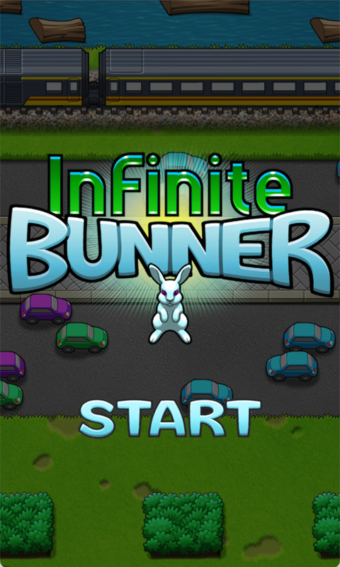

# Bunner for Rust+Macroquad

Original code taken from: https://github.com/rust-gamedev/rust-game-ports

Implementation in Rust+Macroquad of the game Bunner from Code the Classics vol 1.

## Attribution

From the book, Code the Classics

https://wireframe.raspberrypi.org/books/code-the-classics1

Licenced under Creative Commons Attribution-NonCommercial-ShareAlike 3.0 Unported.
https://creativecommons.org/licenses/by-nc-sa/3.0/deed.en_US

